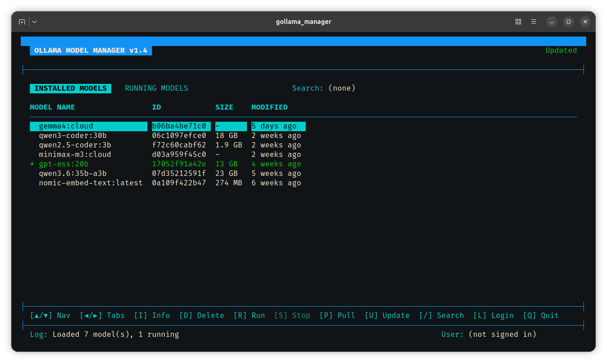
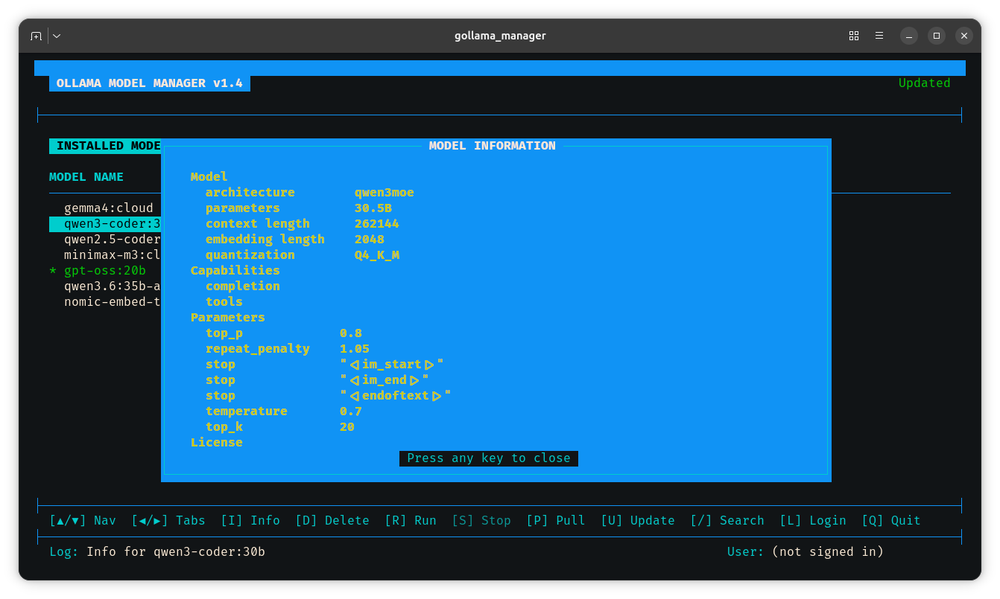
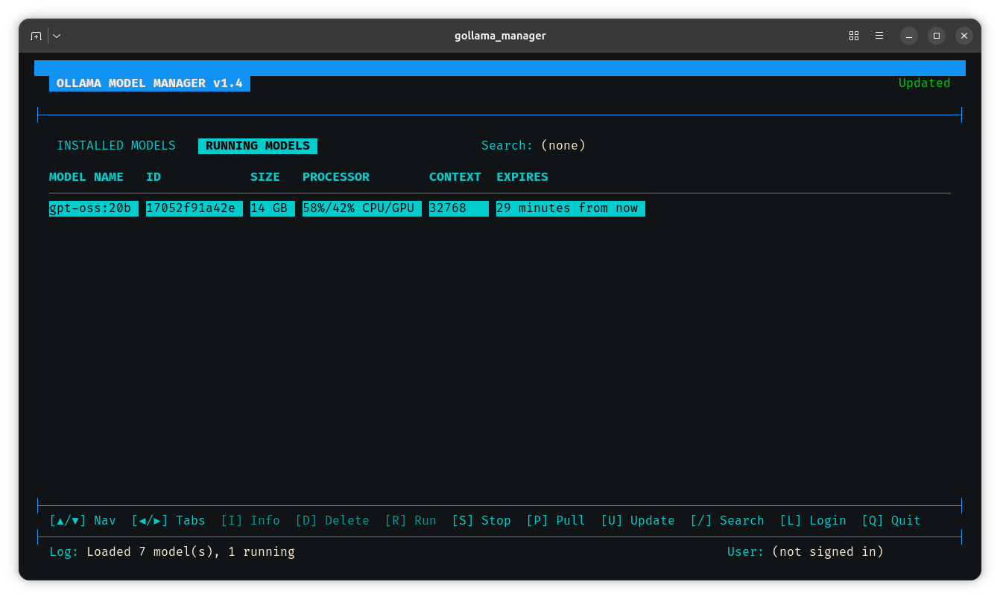
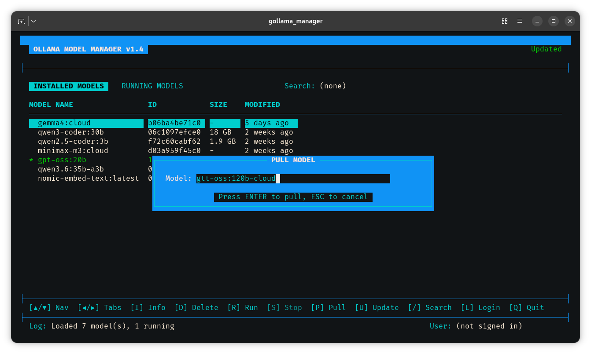
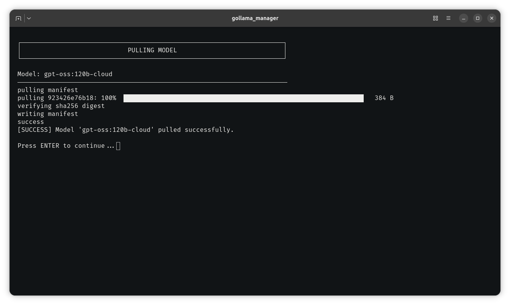
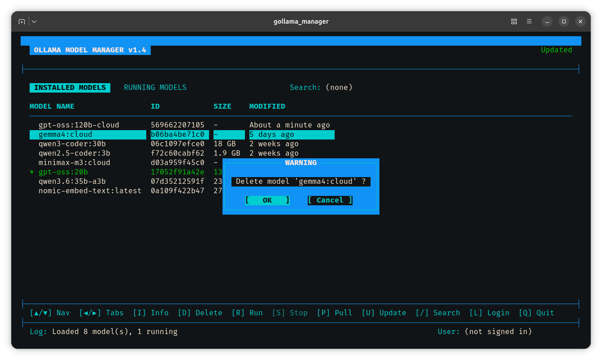
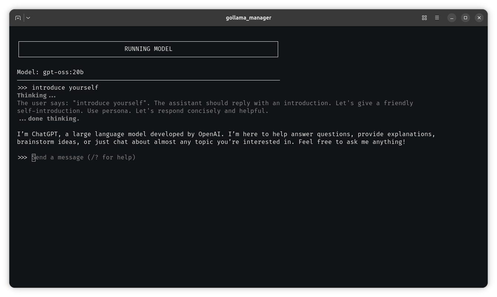
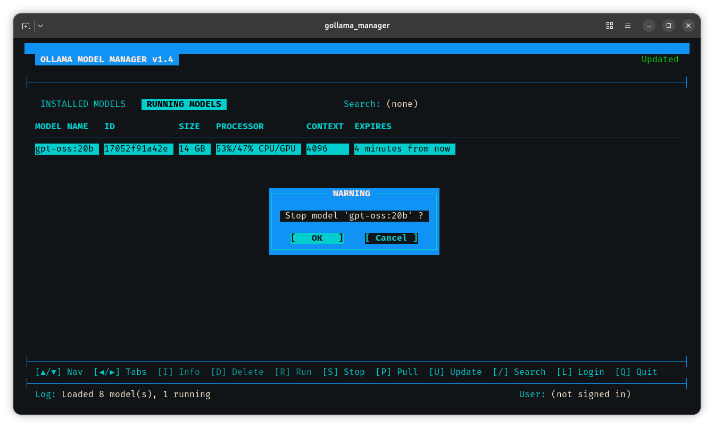

# gOllamaManager

A terminal-based user interface (TUI) for managing Ollama models. Built with C and ncurses, gOllamaManager provides an intuitive console interface to view, pull, delete, and manage your Ollama models. This tool was created specifically to manage LLM models on a remote Linux server running Ollama by means of SSH tunneling.

## Features

- **View Installed Models**: Browse all installed Ollama models with details (name, ID, size, modification date)
- **View Running Models**: Monitor currently running models with processor usage and expiration time
- **Model Information**: View detailed information about any model
- **Delete Models**: Remove installed models with confirmation
- **Run Models**: Run an installed model in a new TUI session
- **Stop Models**: Stop running models with confirmation
- **Pull Models**: Download new models from the Ollama registry
- **Search/Filter**: Quickly find models by name
- **Ollama Login/Logout**: Manage Ollama authentication directly from the TUI
- **Background Update**: Automatic data update in a background thread
- **Color-coded UI**: Easy-to-read interface with color highlighting
- **Scrollable Lists**: Navigate through large model lists that exceed terminal height with scroll indicators (▲/▼)
- **Robust Terminal Recovery**: Safe terminal state handling during external shell operations (e.g., model pulls)

















## Requirements

- Linux operating system
- GCC compiler
- CMake (3.10 or higher)
- ncursesw library (wide-character version)
- pthread library
- Ollama installed and available in PATH

## Installation

### Clone the Repository

```bash
git clone <repository-url>
cd gOllamaManager
```

### Build the Project

Using the provided build script:

```bash
./build.sh release
```

Or manually with CMake:

```bash
mkdir build
cd build
cmake ..
make
```

The executable will be located at `build/bin/gollama_manager`.

### Optional: Install System-wide

```bash
sudo cp build/bin/gollama_manager /usr/local/bin/
```

## Usage

Run the application:

```bash
./build/bin/gollama_manager
```

Or if installed system-wide:

```bash
gollama_manager
```

## Key Bindings

### Navigation

- **UP/DOWN** - Navigate through the model list
- **LEFT/RIGHT** - Switch between "Installed Models" and "Running Models" tabs
- **Tab switching clears the search filter** automatically

### Model Operations

- **I** - Show detailed information about the selected model
- **D** - Delete the selected model (with confirmation)
- **R** - Run the selected model (exits TUI, runs ollama run, then returns)
- **S** - Stop the selected running model (with confirmation)
- **P** - Pull a new model (opens input dialog)

### Search & Filter

- **/** - Open search dialog to filter models by name (case-insensitive)
- The filter is applied in real-time to the installed models list
- Scroll indicators (▲/▼) appear when filtered results exceed terminal height

### Authentication

- **L** - Login to or logout from Ollama
  - Displays the signed-in username in the status bar
  - Detects SSH sessions where browser-based login is unavailable

### Other

- **U** - Update model data in a background thread
- **Q** - Quit the application

### Dialog Controls

- **ENTER** - Confirm action / submit input
- **ESC** - Cancel dialog
- **TAB** - Toggle between OK/Cancel in confirmation dialogs
- **LEFT/RIGHT** - Navigate between OK/Cancel in confirmation dialogs
- **HOME/END** - Jump to start/end of input field
- **DELETE** - Delete character at cursor position
- **INSERT** - Toggle insert/overwrite mode

### Scrolling in Long Lists

When a model list exceeds the visible terminal height:
- **UP/DOWN** automatically scrolls the viewport to keep the selection visible
- **▲** indicator at the top-right of the list shows more items above
- **▼** indicator at the bottom-right of the list shows more items below

## Building from Source

### Debug Build

```bash
./build.sh debug
```

### Release Build

```bash
./build.sh release
```

### Clean Build Artifacts

```bash
./clean.sh
```

### Full Rebuild

```bash
./rebuild.sh release
```

## Technical Details

- **Language**: C (C99/C11 compatible, no VLAs)
- **UI Framework**: ncursesw (wide-character / UTF-8 support)
- **Threading**: pthread with mutex-protected shared state
- **Build System**: CMake
- **Compiler**: GCC with strict warnings enabled

### Robustness Improvements

- **Reentrant string parsing**: Uses `strtok_r` instead of `strtok` for thread-safe tokenization
- **Scroll offset management**: Viewport automatically adjusts when model counts change during refresh
- **Terminal state recovery**: `savetty()` / `resetty()` guards around shell escapes prevent terminal corruption
- **Format-agnostic parsing**: Size fields tolerate both single-token (`4.5GB`) and two-token (`4.5 GB`) formats, as well as cloud model placeholders (`-`)
- **Resize handling**: All dialogs (pull, search, confirm, info) respond correctly to terminal resize events

## License

MIT License

## Author

Gino Francesco Bogo (ᛊᛟᚱᚱᛖ ᛗᛖᚨ ᛁᛊᛏᚨᛗᛁ ᚨcᚢᚱᛉᚢ)

## Contributing

Contributions are welcome! Please feel free to submit issues or pull requests.

## Troubleshooting

### Ollama not found

Ensure Ollama is installed and available in your PATH:

```bash
ollama --version
```

### ncursesw not found

Install ncursesw development library (wide-character version for UTF-8 support):

```bash
# Arch Linux
sudo pacman -S ncursesw

# Ubuntu/Debian
sudo apt-get install libncursesw5-dev

# Fedora/RHEL
sudo dnf install ncurses-devel
```

### Build errors

Ensure you have GCC and CMake installed:

```bash
gcc --version
cmake --version
```

### Terminal display corruption after pull

If the terminal appears corrupted after a model pull operation:
- Press **Q** to quit and restart gOllamaManager
- The application uses `resetty()` / `savetty()` to minimize this risk
- Avoid interrupting (Ctrl+C) the pull subprocess
